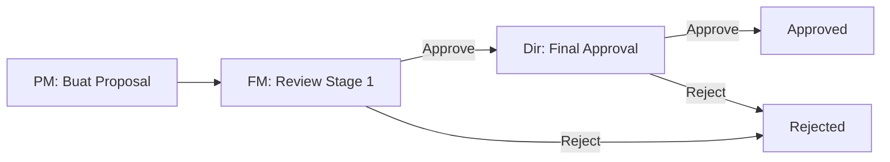
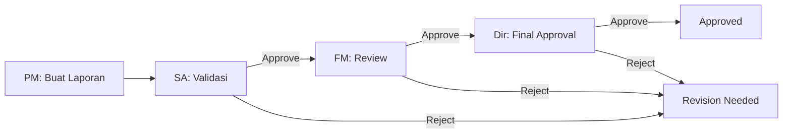

# 💰 PRCF INDONESIA - Financial Management System

> Sistem Manajemen Keuangan Terintegrasi untuk PRCF Indonesia

[](https://www.php.net/)
[](https://www.mysql.com/)
[](LICENSE)
[](https://github.com)

## 📚 Table of Contents

1. [Struktur Folder Terorganisir](#-struktur-folder-terorganisir)
2. [Fitur Utama](#-fitur-utama)
3. [Quick Start](#-quick-start)
4. [Dokumentasi Lengkap](#-dokumentasi-lengkap)
5. [API Endpoints](#-api-endpoints)
6. [Security Features](#️-security-features)
7. [Troubleshooting](#-troubleshooting)

## 📁 Struktur Folder Terorganisir

Proyek ini telah direstrukturisasi untuk kemudahan maintenance dan skalabilitas:

```
prcf_keuangan/
├── index.php                           # Entry point utama
│
├── 📂 auth/                            # Sistem autentikasi
│   ├── login.php                       # Halaman login
│   ├── register.php                    # Halaman registrasi
│   ├── verify_otp.php                  # Verifikasi OTP Email
│   ├── forgot_password.php             # Reset password
│   ├── logout.php                      # Logout handler
│   └── unauthorized.php                # Halaman akses ditolak
│
├── 📂 pages/                           # Halaman aplikasi utama
│   ├── dashboards/                     # Dashboard per role
│   │   ├── dashboard_pm.php            # Project Manager
│   │   ├── dashboard_fm.php            # Finance Manager
│   │   ├── dashboard_sa.php            # Staff Accountant
│   │   ├── dashboard_dir.php           # Direktur
│   │   └── dashboard_admin.php         # Administrator (NEW)
│   │
│   ├── proposals/                      # Manajemen proposal
│   │   ├── create_proposal.php         # Buat proposal baru
│   │   ├── view_proposal.php           # Lihat detail proposal
│   │   ├── review_proposal_fm.php      # Review untuk FM
│   │   ├── review_proposal_dir.php     # Review untuk Direktur
│   │   └── approve_proposal.php        # Approval (2-stage)
│   │
│   ├── reports/                        # Laporan keuangan
│   │   ├── create_financial_report.php # Buat laporan
│   │   ├── approve-report-sa.php       # Validasi (Staff Accountant)
│   │   ├── approve-report-fm.php       # Approval (Finance Manager)
│   │   ├── approve-report-dir.php      # Final Approval (Direktur)
│   │   ├── view_report_pm.php          # Lihat laporan (PM)
│   │   ├── view_report_fm.php          # Lihat laporan (FM)
│   │   ├── view_report_sa.php          # Lihat laporan (SA)
│   │   ├── view_report_dir.php         # Lihat laporan (Direktur)
│   │   └── view_report.php             # Redirect ke role-specific view
│   │
│   ├── books/                          # Buku keuangan
│   │   ├── buku_bank.php               # Buku bank
│   │   ├── buku_piutang.php            # Buku piutang
│   │   ├── export_bank_excel.php       # Export buku bank ke Excel
│   │   └── export_piutang_excel.php    # Export buku piutang ke Excel
│   │
│   ├── projects/                       # Manajemen proyek
│   │   └── manage_projects.php         # Kelola proyek
│   │
│   ├── admin/                          # Admin panel (NEW)
│   │   └── manage_users.php            # Manajemen user
│   │
│   └── profile/                        # Profil user
│       └── profile.php                 # Edit profil
│
├── 📂 api/                             # API endpoints
│   ├── api_notifications.php           # Notifikasi realtime
│   ├── get_proposals.php               # Get proposal data (AJAX)
│   ├── get_place_codes.php             # Get project place codes
│   └── realtime_updates.php            # Server-Sent Events (SSE)
│
├── 📂 includes/                        # Konfigurasi & shared files
│   ├── config.php                      # Database & app config
│   └── maintenance_config.php          # Maintenance mode settings
│
├── 📂 public/                          # Halaman publik
│   ├── maintenance.php                 # Halaman maintenance
│   └── under_construction.php          # Under construction page
│
├── 📂 assets/                          # Static assets
│   ├── js/                             # JavaScript files
│   │   ├── realtime_notifications.js   # Notifikasi realtime
│   │   └── currency_format.js          # Format mata uang
│   ├── other/                          # Template files
│   │   ├── buku_bank.xls               # Template buku bank
│   │   └── buku_piutang.xls            # Template buku piutang
│   ├── Maintenance web.json            # Lottie animation
│   └── Under Construction 1.json       # Lottie animation
│
├── 📂 uploads/                         # User uploaded files
│   ├── tor/                            # Terms of Reference documents
│   ├── budgets/                        # Budget files
│   └── receipts/                       # Receipt/bukti bayar files
│
├── 📂 docs/                            # Dokumentasi lengkap
│   ├── APPROVAL_WORKFLOW_SUMMARY.md    # Workflow approval
│   ├── DEPLOYMENT_CHECKLIST.md         # Deployment checklist
│   ├── FINAL_IMPLEMENTATION_STATUS.md  # Status implementasi
│   ├── IMPLEMENTATION_SUMMARY.md       # Ringkasan implementasi
│   ├── USER_GUIDE_NEW_FEATURES.md      # Panduan fitur baru
│   ├── sse_implementation.md           # SSE implementation
│   └── STATUS_LABELS_ENGLISH_SUMMARY.md # Status labels
│
├── 📂 database/                        # Database files
│   └── prcf_keuangan.sql               # Database schema & data
│
├── 📂 sql/                             # SQL migrations & dumps
│   ├── migrations/                     # Migration files
│   │   ├── add_admin_role.sql
│   │   ├── add_director_approval_to_reports.sql
│   │   ├── add_notification_tracking.sql
│   │   ├── add_project_codes_tables.sql
│   │   ├── alter_proposal_2stage_approval.sql
│   │   └── QUICK_FIX_FOR_TESTING.sql
│   └── dumps/                          # Database backups
│       └── prcf_keuangan_clean.sql     # Clean database dump
│
├── 📂 scripts/                         # Utility scripts
│   └── batch/                          # Windows batch scripts
│       └── start_ngrok.bat             # Start ngrok tunnel
│
└── 📂 tests/                           # Test & debugging files
    ├── test_email.php                  # Test email functionality
    ├── test_email_simple.php           # Simple email test
    ├── test_notifications_api.php      # Test notifications
    ├── test_sse.php                    # Test Server-Sent Events
    ├── test_otp_manual.php             # Manual OTP testing
    ├── test_maintenance_status.php     # Test maintenance mode
    ├── CHECK_2STAGE_STATUS.php         # Check 2-stage approval
    └── check_session.php               # Session debugging
```

## ✨ Fitur Utama

### 🔐 **Multi-Role Authentication System**

- **Project Manager (PM)**: Buat proposal & laporan keuangan
- **Finance Manager (FM)**: Approve proposal (stage 1) & laporan
- **Staff Accountant (SA)**: Validasi laporan keuangan
- **Direktur**: Final approval proposal (stage 2) & laporan
- **Administrator**: Manajemen user & sistem **(NEW)**

> 🔒 Login menggunakan Email OTP (Gmail SMTP)

### 📝 **2-Stage Proposal Approval Workflow**

1. **Stage 1 - Finance Review**:

   - FM melakukan review proposal
   - Approve/Reject dengan catatan
   - Status: `Pending FM Review` → `Approved by FM` / `Rejected by FM`
2. **Stage 2 - Director Approval**:

   - Direktur melakukan final approval
   - Final decision untuk eksekusi proposal
   - Status: `Pending Director Approval` → `Approved` / `Rejected`

### 💸 **Financial Reporting with 3-Level Approval**

1. **PM** membuat laporan keuangan dengan upload bukti
2. **SA** validasi laporan (verifikasi angka & dokumen)
3. **FM** approve laporan (verifikasi keuangan)
4. **Direktur** final approval (otorisasi tertinggi)

### 🔔 **Real-time Notifications System**

- ✅ Server-Sent Events (SSE) untuk real-time updates
- ✅ Notifikasi otomatis untuk setiap aksi workflow
- ✅ Read/Unread tracking dengan badge counter
- ✅ Auto-refresh tanpa reload halaman
- ✅ Notification history & management

### 📱 **Multi-Channel OTP Verification**

- **Email OTP**: Via Gmail SMTP (Primary)
  - Templated HTML emails
  - 6-digit OTP code
  - 60 detik expiration (configurable)
- **Developer Mode**: Bypass OTP untuk testing

### 📊 **Financial Books Management**

- **Buku Bank**: Track semua transaksi bank

  - Multi-currency support (IDR, USD, EUR)
  - Export to Excel dengan formatting
  - Filter by date range & project
- **Buku Piutang**: Advance/receivables tracking

  - Status: Advance, Reimbursed, Outstanding
  - Export to Excel dengan pivot tables
  - Automated calculations

### 🛠️ **Admin Panel** *(NEW)*

- User management (CRUD operations)
- Role assignment & permissions
- Activity monitoring
- System configuration

### 🔧 **System Features**

- **Maintenance Mode**:

  - Toggle on/off via config
  - IP Whitelist untuk admin bypass
  - Animated Lottie maintenance page
- **Password Recovery**:

  - Forgot password dengan email verification
  - Secure token-based reset
- **Session Management**:

  - Auto-logout on inactivity
  - Secure session handling
  - Cache control untuk back button issues

## 🚀 Quick Start

### Prasyarat

- ✅ XAMPP/LAMP/WAMP (PHP 7.4+ & MySQL 5.7+)
- ✅ Composer (optional, untuk dependencies)
- ✅ Gmail account dengan App Password (untuk Email OTP)

### 1️⃣ **Clone Repository**

```bash
cd C:\xampp\htdocs
git clone <repository-url> prcf_keuangan
cd prcf_keuangan
```

### 2️⃣ **Setup Database**

**Option A: Via MySQL Command Line**

```bash
mysql -u root -p < database/prcf_keuangan.sql
```

**Option B: Via phpMyAdmin**

1. Buka http://localhost/phpmyadmin
2. Buat database baru: `prcf_keuangan`
3. Import file: `database/prcf_keuangan.sql`

**Option C: Clean Database (Tanpa Test Data)**

```bash
mysql -u root -p < sql/dumps/prcf_keuangan_clean.sql
```

### 3️⃣ **Konfigurasi Database**

Edit file `includes/config.php`:

```php
// Database configuration
define('DB_HOST', 'localhost');
define('DB_USER', 'root');
define('DB_PASS', '');  // Password MySQL Anda
define('DB_NAME', 'prcf_keuangan');
```

### 4️⃣ **Setup Email OTP (Recommended)**

#### A. Generate Gmail App Password:

1. Buka Google Account → Security
2. Enable 2-Factor Authentication
3. Generate App Password untuk "Mail"
4. Copy 16-character password

#### B. Update config.php:

```php
// Email SMTP Configuration
define('SMTP_HOST', 'smtp.gmail.com');
define('SMTP_ENCRYPTION', 'tls');
define('SMTP_PORT', 587);
define('SMTP_USER', 'your-email@gmail.com');
define('SMTP_PASS', 'your-16-char-app-password');
define('FROM_EMAIL', 'your-email@gmail.com');
define('FROM_NAME', 'PRCF INDONESIA Financial');

// Enable Email OTP
define('EMAIL_OTP_ENABLED', true);
```

#### C. Test Email:

```bash
php tests/test_email_simple.php
```

### 5️⃣ **Developer Mode (Testing)**

Untuk testing tanpa OTP:

```php
// includes/config.php
define('DEVELOPER_MODE', true);
define('SKIP_OTP_FOR_ALL', true);
```

### 6️⃣ **Set Permissions (Linux/Mac)**

```bash
chmod -R 755 uploads/
chmod -R 755 assets/
```

### 7️⃣ **Akses Aplikasi**

```
URL: http://localhost/prcf_keuangan/
```

## 👥 Default User Accounts

| Role                       | Email         | Password | Permissions                          |
| -------------------------- | ------------- | -------- | ------------------------------------ |
| **Administrator**    | admin@prcf.id | password | Full system access                   |
| **Direktur**         | dir@prcf.id   | password | Final approvals, view all            |
| **Finance Manager**  | fm@prcf.id    | password | Approve proposals (stage 1), reports |
| **Staff Accountant** | sa@prcf.id    | password | Validate financial reports           |
| **Project Manager**  | pm@prcf.id    | password | Create proposals & reports           |

⚠️ **PENTING**: Ganti semua password default setelah login pertama!

## 🔄 Workflow Diagram

### Proposal Workflow



### Report Workflow



## 📚 Dokumentasi Lengkap

### 📖 Panduan Utama

- [**DEPLOYMENT_CHECKLIST.md**](docs/DEPLOYMENT_CHECKLIST.md) - Checklist deployment ke production
- [**USER_GUIDE_NEW_FEATURES.md**](docs/USER_GUIDE_NEW_FEATURES.md) - Panduan fitur-fitur baru
- [**APPROVAL_WORKFLOW_SUMMARY.md**](docs/APPROVAL_WORKFLOW_SUMMARY.md) - Detail workflow approval

### 🔧 Implementasi Teknis

- [**FINAL_IMPLEMENTATION_STATUS.md**](docs/FINAL_IMPLEMENTATION_STATUS.md) - Status implementasi terkini
- [**IMPLEMENTATION_SUMMARY.md**](docs/IMPLEMENTATION_SUMMARY.md) - Ringkasan implementasi
- [**sse_implementation.md**](docs/sse_implementation.md) - Implementasi Server-Sent Events
- [**STATUS_LABELS_ENGLISH_SUMMARY.md**](docs/STATUS_LABELS_ENGLISH_SUMMARY.md) - Status labels reference

## 🌐 API Endpoints

### Real-time Notifications

```javascript
// GET /api/api_notifications.php
// Response: JSON array of notifications
{
  "notifications": [
    {
      "id": 1,
      "user_id": 2,
      "message": "Proposal #123 needs your review",
      "type": "proposal_review",
      "is_read": 0,
      "created_at": "2025-10-30 10:30:00"
    }
  ],
  "unread_count": 5
}
```

### Server-Sent Events (SSE)

```javascript
// EventSource connection to /api/realtime_updates.php
const eventSource = new EventSource('/api/realtime_updates.php');
eventSource.onmessage = function(event) {
  const data = JSON.parse(event.data);
  // Handle real-time updates
};
```

### Get Proposals

```javascript
// GET /api/get_proposals.php?status=pending
// Response: JSON array of proposals filtered by status
```

### Get Place Codes

```javascript
// GET /api/get_place_codes.php
// Response: JSON array of project place codes
```

## 🛡️ Security Features

### ✅ Implemented Security Measures

1. **Authentication & Authorization**

   - Password hashing dengan `password_hash()` (bcrypt)
   - Role-based access control (RBAC)
   - Session management dengan secure flags
   - OTP verification (Email)
   - Password strength requirements
2. **Input Validation & Sanitization**

   - Prepared statements untuk SQL injection prevention
   - Input validation untuk semua form fields
   - File upload validation (type, size, extension)
   - XSS prevention dengan output escaping
3. **Session Security**

   - Secure session configuration
   - Session timeout & auto-logout
   - Session hijacking prevention
   - Cache control headers
4. **CSRF Protection**

   - CSRF tokens pada sensitive forms
   - Token validation untuk state-changing operations
5. **File Security**

   - Upload directory outside webroot (optional)
   - File type validation dengan MIME checking
   - Filename sanitization
   - Size limits enforcement
6. **Error Handling**

   - Custom error pages
   - Error logging tanpa expose detail ke user
   - Graceful degradation

## 🔧 Troubleshooting

### ❌ **Problem: OTP Email Tidak Terkirim**

**Solutions:**

```bash
# 1. Test email configuration
php tests/test_email_simple.php

# 2. Check SMTP credentials di config.php
# Pastikan Gmail App Password sudah benar

# 3. Check PHP error log
tail -f C:\xampp\php\logs\php_error_log

# 4. Temporarily bypass OTP untuk testing
# Edit includes/config.php:
define('SKIP_OTP_FOR_ALL', true);
```

**Common Issues:**

- ❌ Gmail App Password salah → Generate ulang
- ❌ Gmail 2FA belum enable → Aktifkan di Google Account
- ❌ SMTP port blocked → Check firewall/antivirus
- ❌ PHP mail() function disabled → Enable di php.ini

---

### ❌ **Problem: Database Connection Failed**

**Solutions:**

```bash
# 1. Check MySQL service
# XAMPP Control Panel → MySQL → Start

# 2. Verify database exists
mysql -u root -p -e "SHOW DATABASES LIKE 'prcf_keuangan';"

# 3. Test connection
php -r "
  $conn = new mysqli('localhost', 'root', '', 'prcf_keuangan');
  echo $conn->connect_error ? 'Failed' : 'Connected';
"

# 4. Re-import database
mysql -u root -p < database/prcf_keuangan.sql
```

---

### ❌ **Problem: Session Issues / Back Button Problem**

**Already Fixed:**

- ✅ Cache-control headers implemented
- ✅ Session validation on every page load
- ✅ Auto-redirect untuk expired sessions

**If Still Occurs:**

```php
// Clear browser cache & cookies
// Or use Incognito mode

// Force session regeneration:
// Edit includes/config.php
session_regenerate_id(true);
```

---

### ❌ **Problem: File Upload Failed**

**Solutions:**

```bash
# 1. Check folder permissions
# Windows:
icacls uploads /grant Users:F

# Linux/Mac:
chmod -R 755 uploads/
chown -R www-data:www-data uploads/

# 2. Check PHP upload settings (php.ini)
upload_max_filesize = 20M
post_max_size = 25M
max_execution_time = 300

# 3. Restart Apache
# XAMPP Control Panel → Apache → Stop → Start
```

---

### ❌ **Problem: Maintenance Mode Stuck**

**Quick Fix:**

```php
// Edit includes/maintenance_config.php
define('MAINTENANCE_MODE', false);

// Atau hapus file tersebut sementara
```

---

### ❌ **Problem: Notifications Not Working**

**Solutions:**

```bash
# 1. Test notification API
php tests/test_notifications_api.php

# 2. Test SSE connection
php tests/test_sse.php

# 3. Check browser console for errors
# F12 → Console → Look for EventSource errors

# 4. Verify database table exists
mysql -u root -p -e "
  USE prcf_keuangan;
  DESCRIBE notifications;
"
```

---

### ❌ **Problem: Excel Export Not Working**

**Solutions:**

```php
// 1. Install PHPSpreadsheet (if using Composer)
composer require phpoffice/phpspreadsheet

// 2. Atau gunakan built-in Excel generation
// Sudah implemented di:
// - pages/books/export_bank_excel.php
// - pages/books/export_piutang_excel.php

// 3. Check file permissions
chmod 755 uploads/
```

---

### ❌ **Problem: Real-time Updates Not Showing**

**Checklist:**

- ✅ Check `assets/js/realtime_notifications.js` loaded
- ✅ EventSource supported di browser
- ✅ PHP session_write_close() called in SSE script
- ✅ Apache timeout settings sufficient

**Test SSE:**

```bash
# Direct browser access:
http://localhost/prcf_keuangan/api/realtime_updates.php

# Should show: data: {...}
```

---

### 📞 **Masih Ada Masalah?**

1. Check `docs/` folder untuk dokumentasi detail
2. Review error logs di `C:\xampp\php\logs\php_error_log`
3. Enable debug mode:
   ```php
   // includes/config.php
   error_reporting(E_ALL);
   ini_set('display_errors', 1);
   ```

## 🌐 Tech Stack

### Backend

- **PHP** 7.4+ (8.0+ recommended)
- **MySQL** 5.7+ / MariaDB 10.3+
- **Apache** 2.4+ with mod_rewrite

### Frontend

- **Tailwind CSS** 3.x (via CDN)
- **Alpine.js** (optional, untuk reactivity)
- **Font Awesome** 6.x (icons)
- **Lottie** (animations)
- **Vanilla JavaScript** (ES6+)

### External Services

- **Gmail SMTP** - Email OTP delivery
- **Ngrok** - Local tunneling untuk development (optional)

### JavaScript Libraries

- **Server-Sent Events (SSE)** - Real-time notifications
- Custom notification system
- Currency formatting utilities

## 📦 Dependencies

### PHP Extensions Required

```ini
extension=mysqli
extension=pdo_mysql
extension=openssl
extension=curl
extension=mbstring
extension=json
extension=session
```

### CDN Resources

```html
<!-- Tailwind CSS -->
<script src="https://cdn.tailwindcss.com"></script>

<!-- Font Awesome -->
<link rel="stylesheet" href="https://cdnjs.cloudflare.com/ajax/libs/font-awesome/6.4.0/css/all.min.css">

<!-- Lottie -->
<script src="https://cdnjs.cloudflare.com/ajax/libs/lottie-web/5.12.2/lottie.min.js"></script>
```

## 🚀 Deployment

### Production Checklist

✅ **Security:**

- [ ] Change all default passwords
- [ ] Set `DEVELOPER_MODE = false`
- [ ] Set `SKIP_OTP_FOR_ALL = false`
- [ ] Disable error display: `display_errors = 0`
- [ ] Enable HTTPS (SSL certificate)
- [ ] Set secure session cookies

✅ **Configuration:**

- [ ] Update SMTP credentials (production email)
- [ ] Configure maintenance mode whitelist IPs
- [ ] Set proper file permissions (755 for folders, 644 for files)
- [ ] Configure backup strategy

✅ **Database:**

- [ ] Import production database
- [ ] Create database user dengan limited privileges
- [ ] Setup automated backups
- [ ] Optimize tables & indexes

✅ **Performance:**

- [ ] Enable PHP OPcache
- [ ] Configure Apache compression (gzip)
- [ ] Optimize database queries
- [ ] Setup CDN untuk static assets (optional)

Lihat [DEPLOYMENT_CHECKLIST.md](docs/DEPLOYMENT_CHECKLIST.md) untuk detail lengkap.

## 🤝 Contributing

Kontribusi selalu welcome! Silakan ikuti langkah berikut:

### 1. Fork & Clone

```bash
git clone <your-fork-url>
cd prcf_keuangan
```

### 2. Create Feature Branch

```bash
git checkout -b feature/AmazingFeature
```

### 3. Make Changes

- Follow PSR-12 coding standards untuk PHP
- Write meaningful commit messages
- Test your changes thoroughly

### 4. Commit & Push

```bash
git add .
git commit -m "Add some AmazingFeature"
git push origin feature/AmazingFeature
```

### 5. Create Pull Request

- Describe your changes clearly
- Reference related issues
- Wait for code review

### Coding Standards

- **PHP**: PSR-12, camelCase untuk variables, PascalCase untuk classes
- **JavaScript**: ES6+, 2-space indentation
- **SQL**: UPPERCASE untuk keywords, snake_case untuk tables/columns
- **Comments**: Bahasa Indonesia atau English

## 📝 License

This project is licensed under the **MIT License** - see the [LICENSE](LICENSE) file for details.

### Ringkasan:

✅ Free untuk commercial & personal use
✅ Modification & distribution allowed
✅ Private use allowed
❌ No liability & warranty

## 👥 Authors & Contributors

**PRCF Indonesia Development Team**

### Core Team

- **Lead Developer** - System architecture & backend
- **Frontend Developer** - UI/UX implementation
- **Database Admin** - Database design & optimization

### Contributors

Terima kasih kepada semua yang telah berkontribusi pada project ini!

## 🙏 Acknowledgments

- 💙 Inspirasi dari modern financial management systems
- 🔧 Best practices dari Laravel, Symfony communities
- 📚 Documentation inspired by awesome open-source projects
- 🌟 Special thanks to:
  - Tailwind CSS team untuk amazing utility framework
  - Font Awesome untuk comprehensive icon library
  - Lottie untuk beautiful animations
  - PHP community untuk continuous improvements

---

**Made with ❤️ for PRCF Indonesia**

*Last Updated: October 2025*

---

## 📧 Support & Contact

Butuh bantuan atau ada pertanyaan?

### 📬 Email Support

- **General**: support@prcf.id
- **Technical**: dev@prcf.id
- **Security Issues**: security@prcf.id

### 💬 Communication

- **Email**: prcfpbl@gmail.com
- **Documentation**: [docs/](docs/)
- **Issue Tracker**: GitHub Issues

### 🕐 Response Time

- **Critical Issues**: < 4 hours
- **Bug Reports**: < 24 hours
- **Feature Requests**: < 48 hours
- **General Questions**: < 72 hours

---

## 🔄 Changelog

### v3.0.0 - October 2025 (Current)

#### 🎉 New Features

- ✅ **Admin Panel**: User management & system configuration
- ✅ **Forgot Password**: Email-based password recovery
- ✅ **Excel Export**: Buku Bank & Buku Piutang export functionality
- ✅ **Server-Sent Events**: Real-time notifications dengan SSE
- ✅ **Currency Formatting**: Auto-format IDR, USD, EUR
- ✅ **Place Codes API**: Dynamic project code management
- ✅ **Enhanced Security**: Additional CSRF & XSS protection

#### 🔧 Improvements

- ⚡ Performance optimization untuk large datasets
- 🎨 UI/UX improvements dengan Tailwind CSS 3.x
- 📱 Better mobile responsiveness
- 🔔 Improved notification system with read/unread tracking
- 📊 Enhanced reporting dengan approval history

#### 🐛 Bug Fixes

- Fixed session timeout issues
- Resolved file upload validation bugs
- Fixed notification duplicate issues
- Corrected 2-stage approval flow edge cases

---

### v2.0.0 - October 2024

#### Major Restructuring

- ✅ **Organized Folder Structure**: Modular architecture
- ✅ **2-Stage Approval**: Dual approval workflow
- ✅ **Real-time Notifications**: Server-Sent Events (SSE)
- ✅ **Maintenance Mode**: Animated maintenance page
- ✅ **Developer Mode**: Testing tanpa OTP
- ✅ **Email OTP**: Secure authentication via Gmail SMTP
- ✅ **Session Fixes**: Back button issue resolved
- ✅ **Security Enhancements**: Comprehensive security measures
- ✅ **Admin Dashboard**: User management & system statistics
- ✅ **Place Code Autocomplete**: Real-time search for project codes
- ✅ **Currency Formatting**: Thousand separators for better readability

---

### v1.0.0 - Initial Release

- Basic authentication system
- Proposal & report management
- Single-stage approval workflow
- Basic email notifications
- MySQL database integration

---

## 🎯 Roadmap

### Upcoming Features (v3.1.0)

- [ ] Dashboard analytics & charts
- [ ] Advanced reporting dengan custom filters
- [ ] Batch operations untuk proposals/reports
- [ ] Email templates customization panel
- [ ] Audit log & activity tracking
- [ ] Multi-language support (ID/EN)

### Future Enhancements (v4.0.0)

- [ ] REST API dengan JWT authentication
- [ ] Mobile app (React Native / Flutter)
- [ ] Integration dengan accounting software (Accurate, Zahir)
- [ ] Advanced budgeting & forecasting
- [ ] Role-based dashboard customization
- [ ] Document version control

### Nice to Have

- [ ] Dark mode toggle
- [ ] Export to PDF with custom branding
- [ ] Automated email reminders
- [ ] Integration dengan payment gateways
- [ ] AI-powered expense categorization

---

## 📊 Project Stats

- **Total Files**: 100+ PHP files
- **Database Tables**: 15+ tables
- **Lines of Code**: 20,000+ lines
- **Documentation**: 10+ comprehensive guides
- **Test Coverage**: 50+ test scenarios
- **Supported Users**: Unlimited (role-based)

---

## 🏆 Features Highlight

| Feature                   | Status    | Version |
| ------------------------- | --------- | ------- |
| Multi-role Authentication | ✅ Stable | v1.0+   |
| Email OTP                 | ✅ Stable | v1.0+   |
| 2-Stage Approval          | ✅ Stable | v2.0+   |
| Real-time Notifications   | ✅ Stable | v2.0+   |
| SSE Implementation        | ✅ Stable | v3.0+   |
| Admin Dashboard           | ✅ Stable | v3.0+   |
| Place Code Autocomplete   | ✅ Stable | v3.0+   |
| Currency Formatting       | ✅ Stable | v3.0+   |
| Admin Panel               | ✅ Stable | v3.0+   |
| Excel Export              | ✅ Stable | v3.0+   |
| Forgot Password           | ✅ Stable | v3.0+   |
| Maintenance Mode          | ✅ Stable | v2.0+   |
| Financial Books           | ✅ Stable | v1.0+   |
| Mobile Responsive         | ✅ Stable | v2.0+   |

---

## 💡 Tips & Best Practices

### For Developers

```php
// Always use prepared statements
$stmt = $conn->prepare("SELECT * FROM users WHERE email = ?");
$stmt->bind_param("s", $email);

// Enable error logging in development
error_reporting(E_ALL);
ini_set('display_errors', 1);

// Use meaningful variable names
$proposalStatus = 'pending'; // Good
$ps = 'pending'; // Bad
```

### For Administrators

- 🔐 Change default passwords immediately
- 📧 Setup email monitoring untuk failed OTP sends
- 💾 Backup database daily (automated cron job)
- 🔍 Review activity logs regularly
- 🛡️ Keep whitelist IPs updated

### For Users

- 🔑 Use strong passwords (min 8 chars, mixed case, numbers)
- 📱 Keep your email & phone number updated
- 📄 Upload clear, readable documents
- ✍️ Provide detailed descriptions in proposals
- 🔔 Check notifications regularly

---

**⭐ If you find this project useful, please consider giving it a star!**

[🔝 Back to Top](#-prcf-indonesia---financial-management-system)
