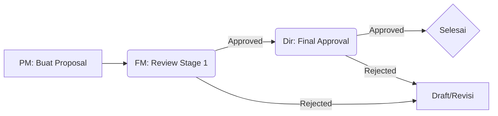
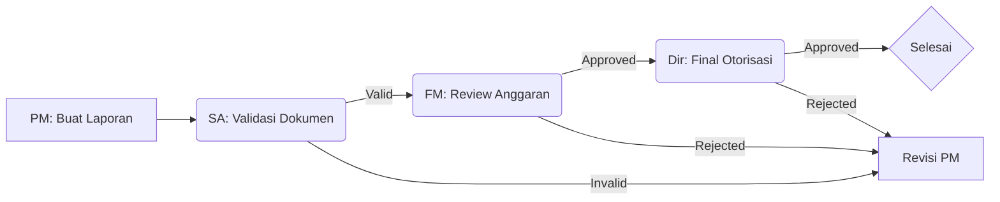

# 💰 PRCF INDONESIA - Financial Management System

Sistem Manajemen Keuangan Terintegrasi untuk PRCF Indonesia. Siap pakai untuk pengembangan lokal dengan Laragon.

## 🚀 Quick Start (Clone & Play)

### 1. Prasyarat

- **Laragon** (Rekomendasi) atau XAMPP (PHP 7.4+ & MySQL 5.7+).
- **Cloudflare Tunnel** (`cloudflared.exe` terinstal di PATH).

### 2. Setup Folder & Database

1. Clone proyek ke folder www Laragon:
   ```bash
   cd C:\laragon\www
   git clone <repository-url> prcf_keuangan
   ```
2. Buat database `prcf_keuangan` di phpMyAdmin.
3. Jalankan master seeder untuk mengisi data awal:
   ```bash
   php scripts/master_seeder.php
   ```

### 3. Konfigurasi

Edit `includes/config.php`:

- `DB_PASS`: Sesuaikan password MySQL Anda.
- `DEVELOPER_MODE`: `true` (Menampilkan OTP di layar untuk testing).
- `SKIP_OTP_FOR_ALL`: `false` (Mengharuskan verifikasi OTP di layar).

### 4. Jalankan Tunnel & Domain

Gunakan domain testing tetap: `https://prcf-test.indevs.in`

1. Aktifkan Apache & MySQL di Laragon.
2. Jalankan script tunnel:
   📂 `scripts/batch/start_tunnel.bat`

---

## 👥 Akun Default (Seeder)

Gunakan akun berikut setelah menjalankan seeder (Password: `password123`):

| Role                 | Email               |
| :------------------- | :------------------ |
| **Administrator**    | `admin@prcf.org`    |
| **Project Manager**  | `pm@prcf.org`       |
| **Finance Manager**  | `fm@prcf.org`       |
| **Staff Accountant** | `sa@prcf.org`       |
| **Direktur**         | `direktur@prcf.org` |

---

## 📁 Alur Kerja (Workflow)

### 📝 Proposal Workflow (2-Stage Approval)



### 📊 Report Workflow (3-Stage Approval)



---

## 📁 Fitur Utama Saat Ini

- **🔐 Multi-Role Auth**: 5 role dengan hak akses dan dashboard berbeda.
- **🔐 OTP Login**: Verifikasi 6-digit (Muncul di layar dalam Developer Mode).
- **💸 Management**: Proposal, Laporan Keuangan, Buku Bank, dan Buku Piutang.
- **📊 Reporting**: Export semua buku keuangan ke format Excel yang rapi.
- **🔔 Real-time**: Notifikasi instan (SSE) untuk setiap perubahan status.
- **🛠️ Admin Panel**: Manajemen user (CRUD) dan konfigurasi sistem.

---

## 🛠️ Tech Stack

- **Backend**: Native PHP 7.4+, MySQL/MariaDB.
- **Frontend**: Tailwind CSS, Vanilla JS, FontAwesome 6.
- **Real-time**: Server-Sent Events (SSE).
- **Tunneling**: Cloudflare Tunnel.
